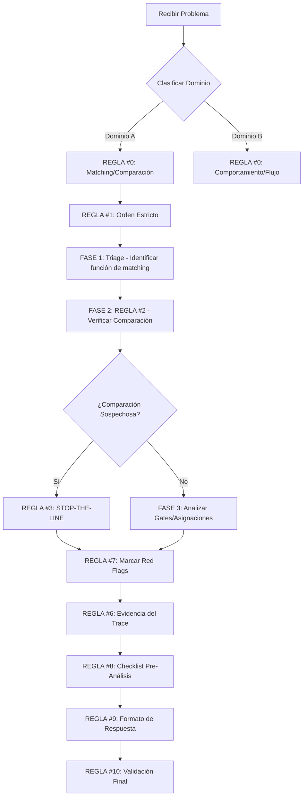
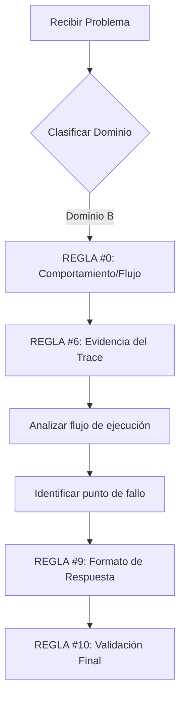

# Metodología Obligatoria de Análisis de Causa Raíz (RCA) para Cursor AI

Este documento establece la metodología obligatoria, el orden estricto y las restricciones para el Análisis de Causa Raíz (RCA) en Cursor AI, dividido en Módulos de aplicación.

---

## MÓDULO MAESTRO Y FUNDAMENTAL

### Reglas de Aplicación Universal

| Regla | Nombre | Aplicación y Acción Obligatoria |
|-------|--------|--------------------------------|
| **REGLA #0** | **IDENTIFICACIÓN OBLIGATORIA DEL DOMINIO 🔎** | Clasifica el problema antes de iniciar:<br>• **Dominio A** (Matching/Comparación) → Aplicar Reglas #1 a #9<br>• **Dominio B** (Comportamiento/Flujo) → Aplicar Reglas #6, #8, #9, #10 |
| **REGLA #9** | **FORMATO DE RESPUESTA OBLIGATORIO 📣** | DEBE empezar con:<br>1. **RESUMEN EJECUTIVO** (Tipo de Problema, Archivo/Línea Exacta, Causa Raíz en 1 frase)<br>2. **ANÁLISIS DE LA FUNCIÓN DE COMPARACIÓN** (Si aplica, con código/falla) |
| **REGLA #6** | **EVIDENCIA OBLIGATORIA DEL TRACE 📝** | Todo análisis debe incluir:<br>• Líneas específicas del trace/log que demuestren el problema<br>• Simulación con datos reales<br>• Código problemático con línea exacta<br>**PROHIBICIÓN:** Explicaciones vagas |
| **REGLA #10** | **VALIDACIÓN FINAL OBLIGATORIA ✅** | Antes de concluir, confirmar:<br>1. Causa raíz explicada con evidencia específica<br>2. Línea exacta identificada<br>3. Se siguió el orden metodológico adecuado (comparación → gates → asignaciones) |

---

## MÓDULO CRÍTICO DE MATCHING (DOMINIO A)

**Si el problema fue clasificado como DOMINIO CRÍTICO A, estas reglas son de aplicación ESTRICTA.**

### Reglas de Análisis Secuencial

| Regla | Nombre | Orden y Restricción Obligatoria |
|-------|--------|--------------------------------|
| **REGLA #1** | **ORDEN ESTRICTO DE ANÁLISIS (NO NEGOCIABLE) 🛑** | **PRIMERO:** Analiza TODAS las funciones de comparación (`equals`, `contains`, etc.)<br>**SEGUNDO:** Analiza gates/filtros posteriores<br>**TERCERO:** Analiza asignaciones y loops<br>**PRIORIDAD ABSOLUTA:** La función de comparación |
| **REGLA #2** | **VERIFICACIÓN OBLIGATORIA DE COMPARACIÓN 🕵️** | Antes de asumir su correcto funcionamiento:<br>1. Buscar `contains()`, asimetrías (A.contains(B) y no B.contains(A)), y falta de normalización (trim, upper, acentos)<br>2. Simular con datos reales<br>3. Documentar hallazgos antes de continuar |
| **REGLA #3** | **STOP-THE-LINE EN CASOS SOSPECHOSOS ❌** | Detén el análisis de flujo/gates y enfócate SOLO en la comparación si:<br>• Hay asimetría<br>• `contains` con tokens compartidos<br>• El resultado es incorrecto |
| **REGLA #4** | **PROHIBICIÓN DE ASUMIR CORRECTITUD EN DOMINIO A 🔒** | NUNCA asumas que la comparación funciona bien sin revisarla.<br>Toda función de matching debe ser tratada como sospechosa. |
| **REGLA #5** | **METODOLOGÍA OBLIGATORIA POR FASES ⏱️** | **FASE 1 - Triage:** Contar elementos y buscar la función de matching principal<br>**FASE 2 - Análisis de Comparación:** (Aplicar REGLA #2) Simular con CADA caso del trace<br>**FASE 3 - Gates y Asignaciones:** (Solo después de FASE 2) |
| **REGLA #7** | **RED FLAGS INMEDIATOS EN CÓDIGO 🚩** | Si se encuentran:<br>• `contains()` con tokens compartidos<br>• Asimetría lógica<br>• Variables modificadas dentro de loops que afectan comparaciones<br>→ **MÁRCALOS COMO PROBLEMA PRINCIPAL INMEDIATAMENTE** |
| **REGLA #8** | **CHECKLIST PRE-ANÁLISIS OBLIGATORIO (DOMINIO A) 📝** | Antes de proponer causa raíz, confirmar:<br>☑ ¿Identifiqué y leí línea por línea la función de comparación?<br>☑ ¿Simulé con datos reales?<br>☑ ¿Analicé la comparación ANTES de gates/asignaciones? |

---

## APLICACIÓN PRÁCTICA

### Flujo de Trabajo para Dominio A (Matching)



### Flujo de Trabajo para Dominio B (Comportamiento)



---

## EJEMPLOS DE APLICACIÓN

### Ejemplo 1: Problema de Matching (Dominio A)

**Problema:** "Los items no se están matcheando correctamente"

**Aplicación de Reglas:**

1. **REGLA #0:** Clasificar como Dominio A → Aplicar reglas #1-#9
2. **REGLA #1:** Buscar PRIMERO la función de comparación
3. **REGLA #2:** Verificar `contains()`, asimetrías, normalización
4. **REGLA #6:** Extraer líneas específicas del trace
5. **REGLA #7:** Marcar red flags (ej: `item1.contains(item2)` pero no `item2.contains(item1)`)
6. **REGLA #8:** Checklist pre-análisis
7. **REGLA #9:** Formato de respuesta con resumen ejecutivo
8. **REGLA #10:** Validación final

### Ejemplo 2: Problema de Flujo (Dominio B)

**Problema:** "El proceso se detiene inesperadamente"

**Aplicación de Reglas:**

1. **REGLA #0:** Clasificar como Dominio B → Aplicar reglas #6, #8, #9, #10
2. **REGLA #6:** Evidencia específica del trace
3. **REGLA #9:** Formato de respuesta
4. **REGLA #10:** Validación final

---

## PROHIBICIONES ABSOLUTAS

❌ **NUNCA** asumir que una función de comparación funciona sin verificarla
❌ **NUNCA** analizar gates/asignaciones antes de la función de comparación en Dominio A
❌ **NUNCA** proporcionar análisis sin evidencia específica del trace
❌ **NUNCA** omitir el checklist pre-análisis
❌ **NUNCA** concluir sin validación final

---

## FORMATO DE RESPUESTA OBLIGATORIO

### Template para Dominio A

```markdown
# RESUMEN EJECUTIVO
- **Tipo de Problema:** [Matching/Comparación]
- **Archivo/Línea:** [archivo.js:línea]
- **Causa Raíz:** [1 frase explicativa]

# ANÁLISIS DE LA FUNCIÓN DE COMPARACIÓN
## Código Problemático
```[lenguaje]
[código exacto con número de línea]
```

## Evidencia del Trace
```
[líneas específicas del trace]
```

## Simulación
[Demostración con datos reales]

## Red Flags Detectados
- [ ] contains() con tokens compartidos
- [ ] Asimetría lógica
- [ ] Falta de normalización

# CHECKLIST PRE-ANÁLISIS
- [x] Función de comparación identificada
- [x] Simulación con datos reales
- [x] Análisis completado antes de gates

# VALIDACIÓN FINAL
- [x] Causa raíz con evidencia
- [x] Línea exacta identificada
- [x] Orden metodológico seguido
```

### Template para Dominio B

```markdown
# RESUMEN EJECUTIVO
- **Tipo de Problema:** [Comportamiento/Flujo]
- **Archivo/Línea:** [archivo.js:línea]
- **Causa Raíz:** [1 frase explicativa]

# EVIDENCIA DEL TRACE
```
[líneas específicas]
```

# ANÁLISIS DE FLUJO
[Explicación del comportamiento]

# VALIDACIÓN FINAL
- [x] Causa raíz con evidencia
- [x] Línea exacta identificada
- [x] Orden metodológico seguido
```

---

## NOTAS FINALES

Este documento es de **aplicación obligatoria** para todos los análisis de causa raíz realizados en Cursor AI con FlowTrace MCP. El incumplimiento de estas reglas resulta en análisis incompletos o incorrectos.

**Versión:** 1.0
**Última actualización:** 2025-10-30
